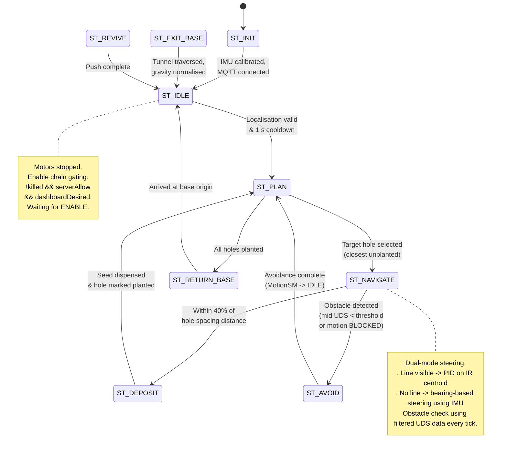
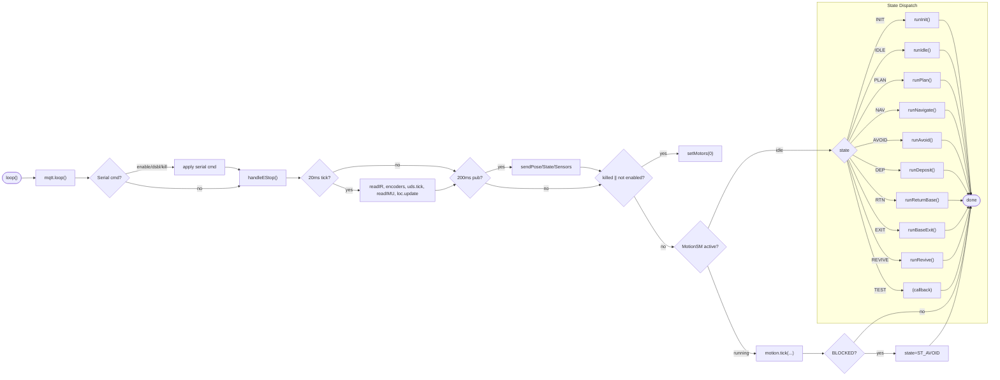
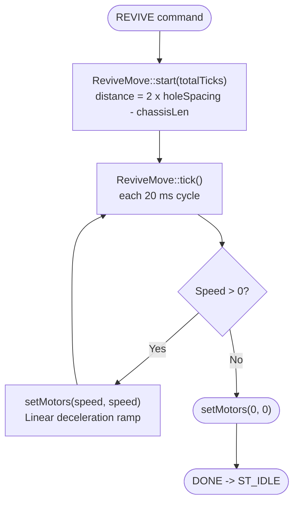
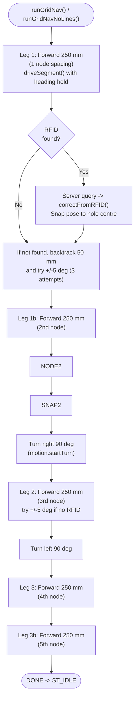
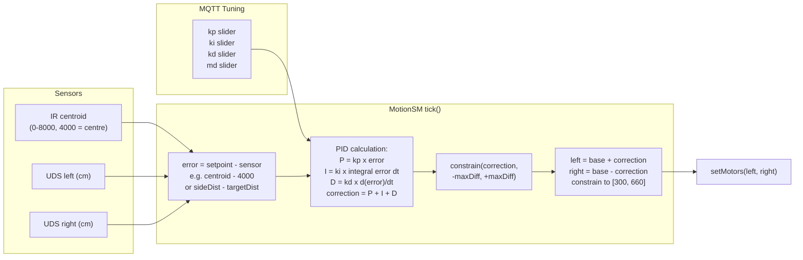
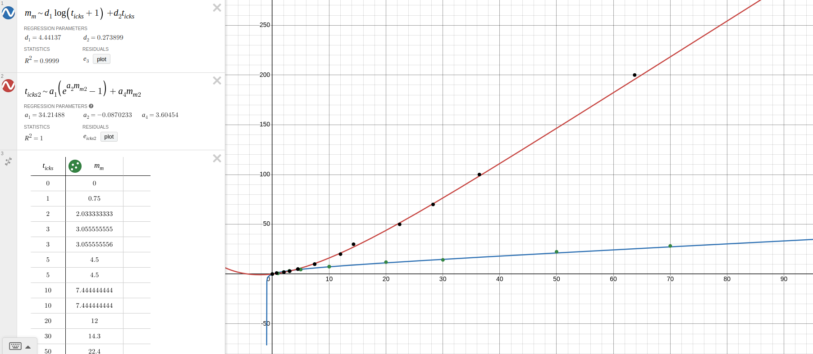
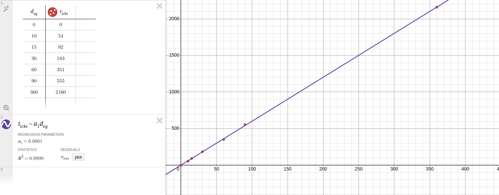

# UCL Year 1 Robotics Challenge

# Terraformer Rover (Haunter)

##### Jonah Wilson-Troy, Wyatt Ip, Ibrahim Syawwal Sofian, Rahul Ranjan

An autonomous robot that navigates a 2.5 m x 2.5 m (actually 2.4 m x 2.4 m...) Martian-themed arena, plants seeds in marked holes, and returns to base -- all autonomously and in collaboration with 13 other rovers.

---

## Getting Started

### Prerequisites

- Arduino Giga R1 WiFi
- Arduino IDE (v2)
- Python 3.9+ and `pip`

### Installation

- Open `final_code/final_code.ino` in the Arduino IDE.

- Fill in `final_code/secrets.h` with your credentials:
  
  `WIFI_SSID` / `WIFI_PASSWORD` -- your 2.4 GHz WiFi network
  
  `BROKER_HOST` -- IP of your MQTT broker
  
  `GROUP_ID` -- your team number

- Install the required libraries via the Library Manager:
  
  - **Motoron** (for motor control)
  - **MFRC522_I2C** (RFID reader)
  - **MiniMessenger** (MQTT wrapper)
  - **LIS3MDL** (Magnetometer library)
  - **LSM6** (Accelerometer library)
  - **Servo** (built-in)
  - **Wire** (built-in)
  - **Arduino** (built-in)
  - **Math** (built-in)

- Select your board and port, then upload.

### Dashboard

We provide a live dashboard served over HTTP that connects to your MQTT broker:

```bash
cd final_code
python3 -m venv venv
source venv/bin/activate       # Windows: venv\Scripts\activate
pip install paho-mqtt
python dashboard.py
```

Open `http://localhost:8081` -- the dashboard shows a map view, sensor readings, PID tuning sliders, test command buttons, and more.

---

## Repository Structure

```
final_code/              # Main robot sketch and dashboard
├── final_code.ino       # Entry point -- setup + 50 Hz main loop + state machine
├── Config.h             # Pin assignments, motor limits, calibration constants
├── Map.h                # Arena map (9x9 hole grid, dynamic coordinate system)
├── Sensors.h            # IR array, UDSF, RDID, IMU, LDR
├── Control.h            # Motor control, non-blocking MotionSM, seed dispense
├── Localisation.h       # Dead-reckoning + RFID correction
├── MQTTManager.h        # MiniMessenger wrapper for MQTT + heartbeat watchdog
├── secrets.h            # WiFi & MQTT credentials (not tracked)
└── dashboard.py         # Python MQTT subscriber + HTTP/SSE server
archive/                 # Previous prototypes and test sketches
```

The robot code is split into **header files by concern**, all `#include`d by the single `.ino`. There is no `.cpp` -- everything is in headers for simplicity.

---

## How It Works

### Sensing

- **IR reflectance array** (9 sensors under the robot) detects line position via a centroid calculation. The IR emitters are used every other cycle to account for ambient light.
- **Ultrasonic rangefinders** (left, mid, right) provide obstacle distance with median-of-3 noise rejection per sensor per cycle plus EMA smoothing (alpha=0.2).
- **RFID** (MFRC522 on I2C) reads base and hole tags. The tag data is parsed via `arena.rfidToHole()` to give grid coordinates.
- **IMU** (LIS3MDL magnetometer + LSM6 accelerometer/gyro) gives a tilt-compensated heading, used as the absolute orientation reference.

### Localisation

Position is dead-reckoned from encoder deltas projected along the IMU heading. A small fraction of the accelerometer double-integration is blended in to help during wheel slip. When an RFID hole tag is read, the pose snaps to the known hole centre.

### Motion

All motion is **non-blocking**. `MotionSM` is a struct with a `tick()` method that advances one step per call. Supported motion types:

- `STRAIGHT` / `TURN` -- open-loop, encoder-counted
- `LINE_FOLLOW` -- PID on IR centroid (with hole-crossing hold)
- `WALL_FOLLOW` -- proportional control on side UDS (configurable side + target distance)
- `CENTRE_TUNNEL` -- proportional on L-R UDS difference
- `AVOID_OBSTACLE` -- multi-phase sensor-driven detour (see flowchart below)

The main loop calls `tick()` every 20 ms, passing current sensor data. This keeps MQTT, e-stop, and sensor reads responsive during movement.

Additionally, `ReviveMove` is a separate helper for open-loop forward with linear deceleration (used for REVIVE command).

### State Machine

The main loop runs a simple state machine:

1. **INIT** -- wait for IMU calibration, MQTT connection
2. **IDLE** -- listen for ENABLE, transition to PLAN after 1 s cooldown
3. **PLAN** -- choose closest unplanted hole via `arena.holeCentre()`
4. **NAVIGATE** -- drive toward target: line-follow via PID on IR centroid when line visible, bearing-based steering when no line. Obstacle check on `filteredUdsM` each tick.
5. **AVOID** -- on obstacle (`BLOCKED` or direct check in NAVIGATE), run the multi-phase `AVOID_OBSTACLE` detour (bidirectional, line-finding)
6. **DEPOSIT** -- heading alignment, RFID search, server fertility query, position, dispense, mark planted
7. **RETURN_BASE** -- navigate back to origin

### Communication

MQTT over WiFi using the **MiniMessenger** library. The robot:

- **Publishes** (at 5 Hz): pose, state, sensor snapshot (16 fields incl. seed index), hole status
- **Subscribes**: ENABLE/DISABLE, heartbeat (server watchdog ~1 s timeout), emergency, PID tuning (`kp`, `ki`, `kd`, `md`), test commands (`FOLLOW_LINE`, `FOLLOW_WALL`, `OBSTACLE_AVOIDANCE`, `DEPOSIT`, `EXIT_BASE`, `REVIVE`, `GRID_NAV`, `GRID_NAV_NOLINES`), heading reset (`HEADING:0`), seed select (`SEED:1`-`SEED:5`)

---

## Software Overview Diagram

The rover firmware is a single Arduino sketch split across header files by concern. All headers are `#include`d into `final_code.ino`, which owns the 50 Hz main loop and the high-level state machine. The Python dashboard communicates over MQTT.


---

## Behaviour Flowcharts

### Main State Machine

The top-level state machine runs inside `loop()` at 50 Hz. State transitions happen only when `MotionSM` is `IDLE` (no active motion in progress). The enable chain (`!killed && serverAllow && dashboardDesired`) gates all motor activity.



### 50 Hz Main Loop

Every 20 ms, the loop reads all sensors, publishes telemetry, checks the safety chain, ticks the motion controller, and then runs the current state behaviour.



### Obstacle Avoidance Sequence

When an obstacle is detected (either via `BLOCKED` return from `STRAIGHT`/`TURN`, or directly in `runNavigate()` via `filteredUdsM`), the main loop transitions to `ST_AVOID`. `runAvoid()` starts the sensor-driven `AVOID_OBSTACLE` sequence inside `MotionSM`, which advances through four phases autonomously.


### Deposit Sequence

The deposit sequence is a **blocking routine** with its own internal sensor-and-MQTT polling loop. It aligns the rover, searches for the RFID tag at the hole, queries the server for fertility, positions the seed chute, dispenses a seed, and marks the hole planted.


### Base Entrance Sequence


### Base Exit Sequence

The base exit navigates a fixed 6-leg path through the base, scans the exit RFID, requests airlock permission from the server (re-sending every 2 s), traverses the tunnel using UDS-based centring, detects doors via front UDS, and detects the end of the tunnel using IMU pitch change (gravity normalisation).


---

### Revive Sequence

The REVIVE command executes an open-loop forward push with linear deceleration, using the dedicated `ReviveMove` helper. It pushes another robot out of the way with controlled momentum.



### Grid Navigation Sequence

The grid navigation commands (`GRID_NAV`, `GRID_NAV_NOLINES`) drive a fixed 5-node L-shaped path, attempting to detect RFID tags at each node to snap the pose.



---

## PID System Overview

Line-following and wall-following use PID controllers whose gains are tuneable at runtime via MQTT. The dashboard has dedicated sliders for `kp`, `ki`, `kd`, and `maxDiff`.



---

## Calibration

The robot requires calibration of its encoder-based motion to achieve accurate dead-reckoning.


### Motor power bias


### Move Calibration

This plots measured distance against encoder ticks for forward movement trials, showing the linear and exponential components of the fitted curve.



### Turn Calibration

This plots measured rotation angle against encoder ticks for turning trials, showing the linear fit used by `ticksForTurn()`.



#### Methodology

(To be filled in)
